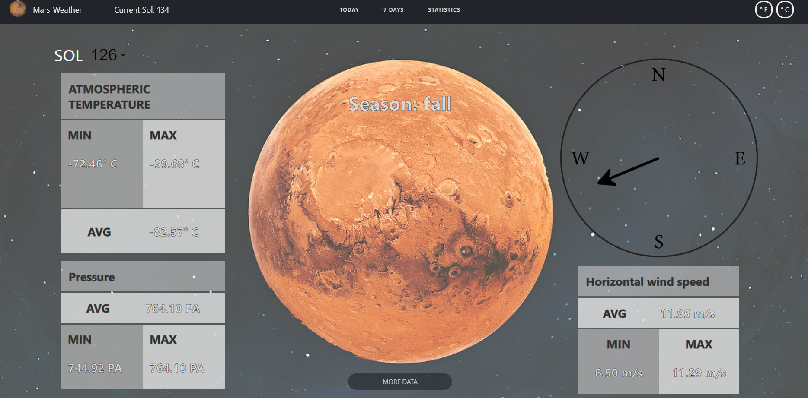

**Table of contents**

1. Introduction
2. Getting Started
3. Usage
4. Licence
5. Project participants

# Mars-Weather App

Mars-Weather App was created as a school project at Haaga-Helia University of Applied Sciences. The application aims to
show weather on the Mars based on the data from NASA open API [https://api.nasa.gov/](https://api.nasa.gov/).

You can read data specification:

[https://api.nasa.gov/assets/insight/InSight%20Weather%20API%20Documentation.pdf](https://api.nasa.gov/assets/insight/InSight%20Weather%20API%20Documentation.pdf)

Application can be accessed on-line:

[https://weather-mars.herokuapp.com/](https://weather-mars.herokuapp.com/).

### Built With

- [React.js](https://reactjs.org/)
- [Bootstrap](https://react-bootstrap.github.io/)
- [Styled components](https://styled-components.com/)
- [React Date Picker](https://reactdatepicker.com/#example-calendar-container)

## Getting started

### Prerequisites

- node 16 or later
- npm 8 or later

### Installation

1. Install NPM packages

 ```sh
   npm install
   ```

2. Start the application

 ```sh
   npm start
   ```

## Functionalities and Usage


When the user opens the website, the data of the last sol is displayed. If there is no data for the
last sol (e.g. problems with sensors on Mars), dashes are displayed. 

1) The user can choose any sol in the database. In this case the data is displayed for selected
    sol, but the user can always see the current sol on the header.
2) By pressing More Data button, average, minimum and maximum values for temperature, pressure, 
    and wind speed are displayed. 

The view when sol data is available: 


The view when more data is displayed: 



The application displays weather for the last 7 sols. If the data is not available due to e.g.
sensor problems on Mars, one can read "no data available": 


The view below displays the data visually. The user should choose sols for which he wants to see
the statistics and press the select button. 


The view below is not in the deployed version due to the limitations of free acounts on Heroku, 
but the code can be found in the repository. The user can choose the period of time base on the 
Earth's calendar and see all available data for this period of time. 


### 2. Browser support

Mars-Weather App supports all major browsers. Version 1.0 of the application is only intended 
for large screens (1350 x 1200 or more). 

### 3. Application main functionalities

Version 1.0 has the following functionalities: 

- displaying number of current sol 
- displaying weather of the current sol
- displaying weather by sol and an option to choose a sol number 
- displaying an average, minimum and maximum values for temperature, pressure and wind speed (current sol and for the chosen sol)
- displaying wind direction (current sol and chosen sol)
- displaying weather of the last seven sols 
- statistics for temperature, pressure and wind 
- displaying data for the chosen period

### 4 Road Map 

Following functionalities are planned in the next version:

- support for smaller screens
- selecting data to be displayed (e.g. temperature, pressure) in the sol selector

## Licence

Licensed under MIT Licence. [Read more](https://choosealicense.com/licenses/mit/)

## Images used in the application 

[Picture of Mars used as a logo](https://freesvg.org/mars-planet) lisensed under Creative Commons. 

[Picture of Mars used as a background](https://pixabay.com/fi/photos/mars-planeetta-tilaa-ulkoavaruus-5564141/) is lisensed under Pixabay lisense. 
[Read more](https://pixabay.com/fi/service/license/)
## Project participants

- Heta Björklund
- Joni Jaakkola
- Christian Lindell
- Dmitry Sinyavskiy
- Irina Tregub - [LinkedIn](https://www.linkedin.com/in/irinatregub/) - irinatregub@gmail.com


